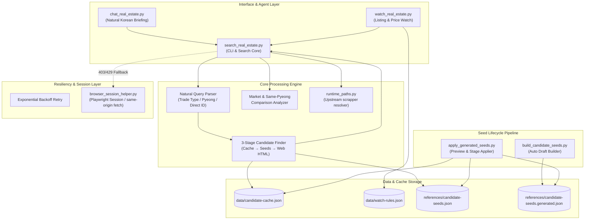
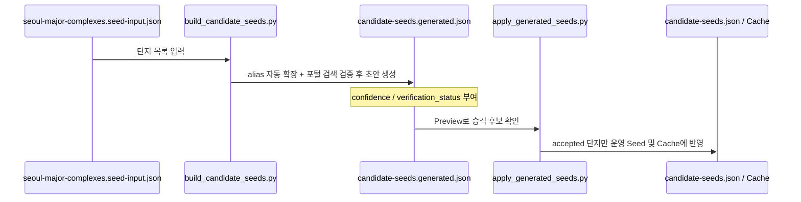

# OpenClaw 네이버 부동산 스킬 (openclaw-naver-real-estate-search)

[](https://www.python.org/)
[](https://github.com/twbeatles/openclaw-naver-real-estate-search)
[](https://github.com/twbeatles/openclaw-naver-real-estate-search)

OpenClaw 및 독립 Python 환경에서 동작하는 **대한민국 네이버 부동산 매물 탐색 / 단지 비교 / 대화형 브리핑 / 시세 감시 스킬**입니다.

자연어 질의를 파싱하여 대한민국 아파트, 오피스텔, 빌라 매물을 검색하고, 동일 평형대 비교 분석, 텔레그램 및 챗봇 연동용 한국어 브리핑, 목표가 및 신규 매물 감시, 레이트 리밋(403/429) 방어용 브라우저 보조 세션을 종합적으로 제공합니다.

---

## 목차
- [주요 특징](#주요-특징)
- [시스템 아키텍처](#시스템-아키텍처)
- [의존성 및 환경 구성](#의존성-및-환경-구성)
- [빠른 시작 (Quick Start)](#빠른-시작-quick-start)
- [주요 스크립트 및 CLI 사용법](#주요-스크립트-및-cli-사용법)
  - [1. 핵심 검색 엔진 (`search_real_estate.py`)](#1-핵심-검색-엔진-search_real_estatepy)
  - [2. 대화형 한국어 브리핑 (`chat_real_estate.py`)](#2-대화형-한국어-브리핑-chat_real_estatepy)
  - [3. 시세 감시 및 이벤트 알림 (`watch_real_estate.py`)](#3-시세-감시-및-이벤트-알림-watch_real_estatepy)
  - [4. 브라우저 세션 보조 헬퍼 (`browser_session_helper.py`)](#4-브라우저-세션-보조-헬퍼-browser_session_helperpy)
  - [5. 단지 Seed 자동 생성 및 검수 파이프라인](#5-단지-seed-자동-생성-및-검수-파이프라인)
- [디렉토리 및 데이터 구조](#디렉토리-및-데이터-구조)
- [안정화 및 운영 권장 가이드](#안정화-및-운영-권장-가이드)
- [배포 및 검증 체크리스트](#배포-및-검증-체크리스트)

---

## 주요 특징

- 🎯 **정밀한 자연어 질의 파싱**: `"잠실 리센츠 전세 30평대"`, `"은마와 래미안대치팰리스 매매 비교"` 등의 문장에서 지역, 단지명, 거래유형(매매/전세/월세), 평형 범위(예: 30평대 → 27~33평)를 자동 추출합니다.
- 🔍 **3단계 단지 후보 탐색 파이프라인**:
  1. `data/candidate-cache.json` (사전 적재된 고속 캐시)
  2. `references/candidate-seeds.json` (검증된 단지 및 수동 검수 큐 기반 힌트)
  3. 네이버 포털 웹 검색 결과 HTML 파싱 (실시간 단지 식별)
- 📊 **동일 평형 기준 단지 비교 요약**: 여러 단지를 비교할 때 평형대(20평대, 30평대, 84㎡ 등)별 최저가/최고가 및 가격 갭을 자동으로 계산하여 브리핑합니다.
- 💬 **상위 에이전트 최적화 한국어 브리핑**: 채팅 표면(텔레그램, 슬랙, OpenClaw AI)에 바로 노출하기 좋은 정갈한 한국어 문장 및 구조화된 stdout JSON 출력을 지원합니다.
- ⏱️ **실시간 매물 및 시세 감시**: 목표가 이하 진입, 신규 매물 등록, 가격 인하 이벤트를 감지하며 중복 알림(Dedupe) 방지 기능이 탑재되어 있습니다.
- 🛡️ **강력한 레이트 리밋(403/429) 복원력**: 지수 백오프, direct URL/ID 우선 탐색, 로컬 Playwright 영구 프로필(`browser_session_helper.py`)을 활용한 same-origin API 호출 보조를 제공합니다.

---

## 시스템 아키텍처

CodeGraph를 통해 분석된 이 프로젝트의 모듈별 연결 관계와 데이터 흐름입니다.



---

## 의존성 및 환경 구성

### 1. 파이썬 환경
Python 3.10 이상을 권장합니다.

```bash
python -m venv .venv
# Windows PowerShell
.venv\Scripts\Activate.ps1
# Linux/macOS
source .venv/bin/activate
```

### 2. 필수 및 권장 패키지 설치
```bash
pip install requests
# 브라우저 보조 헬퍼 사용 시 Playwright 설치 권장
pip install playwright
playwright install chromium
```

### 3. 상위 `naverland-scrapper` 의존성 해결 (선택 사항)
본 스킬은 로컬 `naverland-scrapper`의 코어 파서 및 가격 변환기를 선택적으로 활용합니다.
`scripts/runtime_paths.py`가 다음 우선순위로 자동 탐색합니다:
1. 환경 변수: `NAVERLAND_SCRAPPER_PATH`
2. 워크스페이스 임시 폴더: `tmp/naverland-scrapper`
3. 상위 형제 폴더: `../naverland-scrapper` (예: `D:\twbeatles-repos\naverland-scrapper`)

> **안내**: 로컬 `naverland-scrapper`가 없더라도 자체 내장된 fallback 정규식 파서 및 포맷터(`PriceConverter`, `NaverURLParser`, `build_complex_url`)가 동작하여 단독 실행이 가능합니다.

---

## 빠른 시작 (Quick Start)

> **실행 경로 안내**:
> - 단독 저장소 clone 환경: `python scripts/<스크립트명>.py`
> - OpenClaw 통합 환경: `python skills/naver-real-estate-search/scripts/<스크립트명>.py`

### 1) 자가 진단 (Self-Test)
```bash
python scripts/search_real_estate.py --self-test
python scripts/apply_generated_seeds.py --self-test
```

### 2) 자연어 매물 조회
```bash
# 잠실 리센츠 전세 30평대 매물 조회
python scripts/search_real_estate.py --query "잠실 리센츠 전세 30평대"
```

### 3) 두 단지 동일 평형 비교
```bash
# 리센츠와 엘스 전세 시세 비교 (동일 평형 갭 분석)
python scripts/search_real_estate.py --query "잠실 리센츠와 엘스 전세 비교 30평대" --compare
```

### 4) 한국어 대화형 브리핑
```bash
# 챗봇/텔레그램 메시지에 적합한 요약 브리핑
python scripts/chat_real_estate.py --query "잠실 리센츠와 엘스 전세 비교 30평대" --compare
```

### 5) 가격 및 새 매물 감시 등록
```bash
# 리센츠 30평대 9.5억 이하 목표가 및 새 매물 감시 등록
python scripts/watch_real_estate.py add --name "리센츠 30평대 전세" --query "잠실 리센츠 전세 30평대" --target-max-price 950000000 --notify-on-new --notify-on-price-drop

# 등록된 규칙 감시 체크 (미리보기)
python scripts/watch_real_estate.py check --preview
```

---

## 주요 스크립트 및 CLI 사용법

### 1. 핵심 검색 엔진 (`search_real_estate.py`)

단지 식별, 네이버 부동산 API 조회, 필터링, 비교 분석 및 캐시 관리를 담당하는 핵심 모듈입니다.

```bash
python scripts/search_real_estate.py [OPTIONS]
```

#### 주요 옵션
| 옵션 | 설명 | 예시 |
|---|---|---|
| `--query <TEXT>` | 자연어 검색 질의 (단지명, 지역, 평형, 거래유형 포함 가능) | `--query "잠실 리센츠 전세 30평대"` |
| `--complex-id <ID>` | 네이버 부동산 고유 단지 ID 직접 지정 | `--complex-id 1147` |
| `--url <URL>` | 네이버 부동산 단지 또는 매물 URL 직접 지정 | `--url "https://new.land.naver.com/complexes/1147"` |
| `--trade-types <TYPES>` | 거래 유형 수동 지정 (매매, 전세, 월세 쉼표 구분) | `--trade-types "매매,전세"` |
| `--min-pyeong <N>` | 최소 평형 필터 (전용/공급) | `--min-pyeong 25` |
| `--max-pyeong <N>` | 최대 평형 필터 | `--max-pyeong 34` |
| `--compare` | 검색된 후보 단지 간 시세 및 동일 평형 갭 비교 분석 수행 | `--query "은마 래미안대치팰리스" --compare` |
| `--list-candidates` | 매물 상세를 조회하지 않고 단지 후보 목록만 탐색하여 출력 | `--query "신월시영아파트" --list-candidates` |
| `--resolve-direct` | 입력 질의/URL에서 단지 ID와 canonical URL만 신속 추출 | `--query "complex 1147" --resolve-direct` |
| `--lookup-complex` | 매물 목록을 생략하고 단지 기본 정보(세대수, 주소 등)만 조회 | `--complex-id 1147 --lookup-complex` |
| `--parse-only` | 자연어 질의 파싱 결과만 JSON으로 출력 | `--query "반포자이 20평대 전세" --parse-only` |
| `--show-cache` | 현재 로컬 `candidate-cache.json`에 저장된 단지 조회 | `--show-cache --query "리센츠"` |
| `--seed-candidate` | 단지 정보를 수동으로 캐시에 등록 | `--seed-candidate --complex-id 1147 --candidate-name "리센츠"` |
| `--seed-candidate-file` | `candidate-seeds.json` 파일의 모든 단지를 캐시로 일괄 적재 | `--seed-candidate-file` |
| `--json` | 표준 출력을 기계 판독 가능한 JSON 형식으로 반환 | `--json` |
| `--self-test` | 파서 및 캐시 엔진 무결성 자가 진단 실행 | `--self-test` |

---

### 2. 대화형 한국어 브리핑 (`chat_real_estate.py`)

검색 결과를 사람이나 챗봇 사용자가 읽기 좋은 한국어 문맥으로 요약합니다.

```bash
# 단일 단지 시세 요약 브리핑
python scripts/chat_real_estate.py --query "마포래미안푸르지오 매매 20평대"

# 단지 비교 브리핑 (평형대별 시세 차이 중심)
python scripts/chat_real_estate.py --query "잠실 리센츠와 엘스 전세 비교 30평대" --compare

# 텔레그램/슬랙 봇 연동용 JSON 출력
python scripts/chat_real_estate.py --query "잠실 리센츠 전세 30평대" --json
```

**브리핑 출력 예시**:
```text
[잠실 리센츠]
- 위치: 서울특별시 송파구 잠실동 (5,563세대)
- 전세 시세: 최저 10억 5,000만 ~ 최고 12억 8,000만 (총 18건)
- 30평대 대표 매물: 33평 고층 11억 (남향, 풀확장)
- 상세 링크: https://new.land.naver.com/complexes/1147
```

---

### 3. 시세 감시 및 이벤트 알림 (`watch_real_estate.py`)

관심 단지의 조건을 등록하고, 주기적인 실행(Cron/스케줄러)을 통해 신규 매물 및 가격 인하를 추적합니다.

```bash
python scripts/watch_real_estate.py {add,list,check} [OPTIONS]
```

#### 1) 감시 규칙 추가 (`add`)
```bash
python scripts/watch_real_estate.py add \
  --name "헬리오시티 30평대 전세 급매" \
  --query "가락동 헬리오시티 전세 30평대" \
  --target-max-price 900000000 \
  --notify-on-new \
  --notify-on-price-drop \
  --notes "보증금 9억 이하 매물 알림"
```

#### 2) 등록된 감시 목록 확인 (`list`)
```bash
python scripts/watch_real_estate.py list
```

#### 3) 감시 규칙 실행 및 이벤트 체크 (`check`)
```bash
# 상태 변경 없이 테스트 실행
python scripts/watch_real_estate.py check --preview

# 실제 상태 파일(data/watch-rules.json) 업데이트 및 결과 JSON 반환
python scripts/watch_real_estate.py check --json
```

- 이벤트 감지 시 `events` 배열에 `NEW_ARTICLE`, `PRICE_DROP`, `TARGET_PRICE_MET` 등의 이벤트가 기록되며, 중복 알림은 방지됩니다.

---

### 4. 브라우저 세션 보조 헬퍼 (`browser_session_helper.py`)

네이버 부동산의 403 Forbidden 또는 429 Too Many Requests 발생 시 로컬 Playwright 브라우저 세션을 통해 우회하고 canonical 정보를 확보합니다.

```bash
python scripts/browser_session_helper.py {resolve,capture,fetch} [OPTIONS]
```

#### 1) 텍스트/URL에서 Canonical ID 추출 (`resolve`)
```bash
python scripts/browser_session_helper.py resolve --text "https://new.land.naver.com/complexes/1147"
```

#### 2) 로컬 브라우저로 접속하여 세션 및 ID 캡처 (`capture`)
```bash
# 브라우저 창을 띄워 사용자가 캡차/로그인을 마칠 시간을 확보한 뒤 단지 ID 캡처
python scripts/browser_session_helper.py capture --url "https://new.land.naver.com/complexes/1147" --wait-seconds 5
```

#### 3) Same-Origin 콘텍스트 API 호출 (`fetch`)
브라우저 환경 내에서 세션 쿠키를 유지한 채 API를 직접 요청하여 매물 JSON을 조회합니다.
```bash
python scripts/browser_session_helper.py fetch --complex-id 1147 --trade-types 전세 --pages 1 --headless
```

---

### 5. 단지 Seed 자동 생성 및 검수 파이프라인

새로운 단지들을 시스템에 대량 등록할 때 검색 정확도를 높이기 위한 3단계 생명주기입니다.



#### 1단계: 시드 초안 자동 생성 (`build_candidate_seeds.py`)
```bash
python scripts/build_candidate_seeds.py \
  --input references/seoul-major-complexes.seed-input.json \
  --output references/candidate-seeds.generated.json \
  --pause 0.2 \
  --print-summary
```

#### 2단계: 승격 후보 및 검수 큐 미리보기 (`apply_generated_seeds.py`)
파일을 직접 수정하지 않고 승격 가능한 `accepted` 목록과 `manual_review_queue` 목록을 확인합니다.
```bash
# 전체 미리보기
python scripts/apply_generated_seeds.py --json

# 특정 단지만 선별 확인
python scripts/apply_generated_seeds.py --only-names "리센츠,은마,신월시영아파트" --json
```

#### 3단계: 운영 파일 및 캐시 반영
```bash
# 검증된 항목만 references/candidate-seeds.json에 반영하고 data/candidate-cache.json에 적재
python scripts/apply_generated_seeds.py --apply-target --apply-cache --json
```

---

## 디렉토리 및 데이터 구조

```
openclaw-naver-real-estate-search/
├── scripts/
│   ├── runtime_paths.py            # 경로 해석 및 upstream scrapper 연동
│   ├── search_real_estate.py       # 핵심 검색/파싱/비교 엔진 CLI
│   ├── chat_real_estate.py         # 자연어 한국어 브리핑 CLI
│   ├── watch_real_estate.py        # 매물 및 시세 감시 CLI
│   ├── browser_session_helper.py   # Playwright 세션 보조 및 403/429 우회 헬퍼
│   ├── build_candidate_seeds.py    # 서울 주요 단지 seed 자동 수집/빌더
│   └── apply_generated_seeds.py    # seed 초안 검수 및 운영 승격 도구
├── references/
│   ├── seoul-major-complexes.seed-input.json  # 시드 원본 입력 (서울 주요 아파트 목록)
│   ├── candidate-seeds.json                   # 운영 검수 통과 단지 및 검수 대기 큐
│   ├── candidate-seeds.generated.json         # 자동 빌더가 생성한 초안 데이터
│   ├── candidate-seed-builder.md              # 시드 빌더 설계 문서
│   └── design.md                              # 스킬 종합 설계 및 UX 문서
├── data/
│   ├── candidate-cache.json        # 런타임 단지 alias / ID 캐시
│   ├── watch-rules.json            # 등록된 매물 감시 규칙 및 이벤트 기록
│   └── browser-profile/            # (gitignore) 로컬 브라우저 세션 캐시
├── README.md                       # 프로젝트 종합 가이드 (본 문서)
├── SKILL.md                        # OpenClaw Skill 명세서
└── .gitignore                      # Git 제외 설정
```

---

## 안정화 및 운영 권장 가이드

1. **단일 단지 우선 (Direct Lookup First)**:
   - 레이트 리밋이 의심되거나 정확한 조회가 필요할 때는 broad query(지역 전체 검색) 대신 canonical complex ID나 URL(`--complex-id`, `--url`)을 우선 지정하세요.
2. **캐시 워밍업 (Warm Cache)**:
   - 자주 조회하는 주요 아파트는 `python scripts/search_real_estate.py --seed-candidate-file`로 미리 캐시에 적재해두면 포털 검색 호출 없이 즉시 매물을 탐색할 수 있습니다.
3. **403/429 차단 발생 시 대응**:
   - `search_real_estate.py`는 지수 백오프 후 자동으로 `browser_session_helper.py` 콘텍스트를 호출합니다.
   - 로컬 환경에서 차단이 지속될 경우 `python scripts/browser_session_helper.py capture --url <단지URL>`로 세션을 갱신하세요.
4. **로컬 세션 파일 보안**:
   - `data/browser-session.json`, `data/*.log`, `data/browser-profile/` 등은 로그인 정보나 로컬 상태를 포함할 수 있으므로 Git 추적 대상에서 제외되어 있습니다.

---

## 배포 및 검증 체크리스트

1. [x] **Self-Test 확인**:
   ```bash
   python scripts/search_real_estate.py --self-test
   python scripts/apply_generated_seeds.py --self-test
   ```
2. [x] **실제 대표 질의 조회 테스트**:
   ```bash
   python scripts/search_real_estate.py --query "잠실 리센츠 전세 30평대"
   ```
3. [x] **비교 분석 및 브리핑 검증**:
   ```bash
   python scripts/chat_real_estate.py --query "잠실 리센츠와 엘스 전세 비교 30평대" --compare
   ```
4. [x] **감시 규칙 체크**:
   ```bash
   python scripts/watch_real_estate.py check --preview
   ```
5. [x] **문서 및 Git 동기화**:
   - `.gitignore` 무결성 확인
   - `git push origin master`

---

## 라이선스
MIT License or OpenClaw Ecosystem License.
자세한 라이선스 사항은 상위 프로젝트 정책을 따릅니다.
