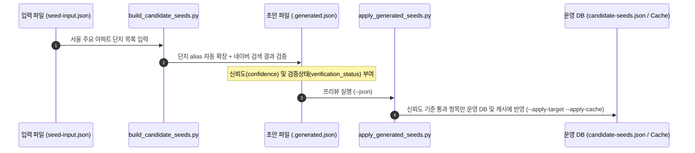

# OpenClaw 네이버 부동산 스킬 (openclaw-naver-real-estate-search)

[](https://www.python.org/)
[](https://opensource.org/licenses/MIT)
[](https://github.com/twbeatles/openclaw-naver-real-estate-search)
[](https://github.com/psf/black)
[](tests/test_naver_collect.py)

> **네이버 부동산(Naver Land) 자연어 매물 검색, 단지 간 동일 평형 비교 분석, 챗봇/메신저용 한국어 브리핑, 실시간 급매·호가 감시 및 레이트 리밋(403/429) 방어를 지원하는 올인원 Python 스킬 엔진**

---

## 📌 핵심 검색 키워드 (Tags & Keywords)
`네이버 부동산` `네이버 부동산 크롤러` `네이버 부동산 API` `아파트 실거래가` `호가 비교` `전세 시세` `부동산 갭투자 분석` `동일 평형 비교` `네이버 부동산 403 차단 우회` `Playwright 세션 관리` `OpenClaw 부동산 스킬` `부동산 텔레그램 알림봇` `급매 감시` `Python Real Estate Scraper`

---

## 📖 목차
1. [프로젝트 소개](#-프로젝트-소개)
2. [주요 특징 (Key Features)](#-주요-특징-key-features)
3. [30초 빠른 시작 (Quick Start)](#-30초-빠른-시작-quick-start)
4. [시스템 아키텍처 & 동작 원리](#-시스템-아키텍처--동작-원리)
5. [주요 스크립트 & CLI 상세 사용법](#-주요-스크립트--cli-상세-사용법)
   - [1. 핵심 검색 엔진 (`search_real_estate.py`)](#1-핵심-검색-엔진-search_real_estatepy)
   - [2. 대화형 한국어 브리핑 (`chat_real_estate.py`)](#2-대화형-한국어-브리핑-chat_real_estatepy)
   - [3. 시세 및 급매 감시 (`watch_real_estate.py`)](#3-시세-및-급매-감시-watch_real_estatepy)
   - [4. 브라우저 세션 보조 헬퍼 (`browser_session_helper.py`)](#4-브라우저-세션-보조-헬퍼-browser_session_helperpy)
   - [5. 단지 Seed 라이프사이클 파이프라인](#5-단지-seed-라이프사이클-파이프라인)
6. [모듈 및 디렉토리 구조](#-모듈-및-디렉토리-구조)
7. [안정적인 운영 및 차단 방어 가이드](#-안정적인-운영-및-차단-방어-가이드)
8. [테스트 및 품질 검증](#-테스트-및-품질-검증)
9. [자주 묻는 질문 (FAQ)](#-자주-묻는-질문-faq)

---

## 🌟 프로젝트 소개

**OpenClaw 네이버 부동산 스킬**은 대한민국 부동산 시장 분석을 자동화하기 위해 설계된 엔터프라이즈급 검색 엔진 모듈입니다.

단순한 웹 스크래퍼를 넘어, 사용자의 일상 자연어(예: *"잠실 리센츠 전세 30평대"*, *"은마와 래미안대치팰리스 매매 갭 차이"*)를 지능적으로 해석하고, 다단계 단지 식별 파이프라인과 평형 표준화 알고리즘을 거쳐 최적의 매물 데이터와 가공된 요약 분석을 제공합니다.

OpenClaw AI 에이전트의 스킬로 직접 마운트하거나, 독립 CLI 도구 및 백엔드 서비스의 마이크로 모듈로 유연하게 운용할 수 있습니다.

---

## ⚡ 주요 특징 (Key Features)

- 🧠 **스마트 자연어 질의 파싱 (NLP Parsing)**:
  - 단지명, 지역명, 거래유형(매매/전세/월세), 평형 범위(예: `30평대` → `27~33평`, `84㎡` 자동 치환)를 완벽하게 분리 추출.
  - 매물 번호(Article ID)나 단지/매물 URL 직접 입력 시에도 자동 단지 역조회(Reverse Lookup) 지원.
- 🎯 **3단계 초고속 단지 후보 탐색 파이프라인**:
  - `1단계`: 로컬 고속 캐시 (`data/candidate-cache.json`)
  - `2단계`: 사전 검증된 단지 시드 DB (`references/candidate-seeds.json`)
  - `3단계`: 네이버 포털 웹 검색 결과 실시간 HTML 파싱
- ⚖️ **동일 평형 기준 단지 비교 (Same-Pyeong Gap Analysis)**:
  - 2개 이상의 단지를 비교할 때 평형대(20평대, 30평대, 전용면적)를 정규화하여 평당가, 최저 호가, 단지 간 가격 갭(Gap)을 자동 산출.
- 💬 **채팅/메신저 최적화 한국어 브리핑**:
  - LLM 또는 텔레그램/슬랙 봇에 바로 렌더링할 수 있는 가독성 높은 한국어 문장 포맷 및 표준화된 JSON 이중 출력.
- ⏰ **실시간 매물 및 급매 감시 (Watch & Alert)**:
  - 목표가 이하 매물 출현, 신규 매물 등록, 기존 매물 호가 인하 감지.
  - 중복 알림 방지(Deduplication) 및 쿨다운 상태 관리 내장.
- 🛡️ **네이버 레이트 리밋(403/429) 강력 방어**:
  - 지수 백오프(Exponential Backoff), Direct Complex ID 우선 탐색.
  - 헤드리스 Playwright 브라우저 세션(`browser_session_helper.py`)을 통한 Same-Origin 쿠키/세션 우회 호출.

---

## 🚀 30초 빠른 시작 (Quick Start)

### 1. 환경 준비 및 설치

```bash
# 저장소 복제 및 가상환경 구성
git clone https://github.com/twbeatles/openclaw-naver-real-estate-search.git
cd openclaw-naver-real-estate-search
python -m venv .venv

# 가상환경 활성화 (Windows PowerShell)
.venv\Scripts\Activate.ps1
# 가상환경 활성화 (Linux / macOS)
source .venv/bin/activate

# 필수 라이브러리 설치
pip install requests playwright pytest
playwright install chromium
```

### 2. 바로 실행해보는 한 줄 명령어

```bash
# [1] 자연어 매물 검색: 잠실 리센츠 30평대 전세
python scripts/search_real_estate.py --query "잠실 리센츠 전세 30평대"

# [2] 두 단지 시세 비교: 리센츠 vs 엘스 30평대 비교
python scripts/search_real_estate.py --query "잠실 리센츠와 엘스 전세 비교 30평대" --compare

# [3] 챗봇용 친화적 한국어 브리핑
python scripts/chat_real_estate.py --query "마포래미안푸르지오 매매 20평대"

# [4] 엔진 자가 진단 실행
python scripts/search_real_estate.py --self-test
```

---

## 🏗️ 시스템 아키텍처 & 동작 원리

본 시스템은 자연어 수신부터 정규화, API 통신, 결과 분석, 브리핑 생성까지 모듈화된 파이프라인으로 구성되어 있습니다.

```mermaid
flowchart TD
    subgraph Client_Layer [사용자 및 에이전트 인터페이스]
        CLI["search_real_estate.py<br/>(CLI & 검색 엔진 코어)"]
        Chat["chat_real_estate.py<br/>(자연어 한국어 브리핑)"]
        Watch["watch_real_estate.py<br/>(시세 감시 & 급매 알림)"]
    end

    subgraph Parsing_Candidate_Layer [파싱 및 단지 식별 계층]
        Parser["자연어 쿼리 파서<br/>(거래유형 / 평형 / URL / ID)"]
        Finder["3단계 단지 탐색기<br/>(Cache → Seeds → Web Search)"]
        ReverseLookup["article_lookup.py<br/>(매물 ID ➔ 단지 ID 역조회)"]
    end

    subgraph Collection_Engine [네이버 부동산 통신 계층 (naver_collect)]
        ArticleAPI["article_api.py<br/>(매물 API 규격 & 페이지네이션)"]
        SiteContract["site_contract.py<br/>(신규/구형/모바일 엔드포인트)"]
        Converters["converters.py<br/>(단위 변환 / 한글 금액 / 갭 계산)"]
        RetryEngine["retry.py<br/>(지수 백오프 & 재시도 핸들러)"]
        ResponseCapture["response_capture.py<br/>(원시 페이로드 표준화)"]
    end

    subgraph Resiliency_Session [레이트 리밋 방어 계층]
        BrowserHelper["browser_session_helper.py<br/>(Playwright 세션 / Same-Origin Fetch)"]
    end

    subgraph Storage_Layer [데이터 저장소]
        CacheFile[("data/candidate-cache.json")]
        SeedFile[("references/candidate-seeds.json")]
        WatchFile[("data/watch-rules.json")]
    end

    CLI --> Parser
    Chat --> CLI
    Watch --> CLI

    Parser --> Finder
    Finder --> ReverseLookup
    Finder <--> CacheFile
    Finder <--> SeedFile

    CLI --> ArticleAPI
    ArticleAPI --> SiteContract
    ArticleAPI --> RetryEngine
    ArticleAPI --> ResponseCapture
    ResponseCapture --> Converters

    CLI -. 403/429 차단 발생 시 Fallback .-> BrowserHelper
    Watch <--> WatchFile
```

### 동작 파이프라인 단계
1. **질의 분석**: 자연어에서 거래 방식(`매매/전세/월세`), 면적 조건(`30평대` 등), 단지명을 정규식 기반으로 분류.
2. **단지 식별 (Resolution)**:
   - 캐시(`candidate-cache.json`) 또는 시드(`candidate-seeds.json`)에서 일치하는 단지 고유 번호(Complex ID)를 탐색.
   - 캐시에 없을 경우 네이버 통합 검색 포털을 스크랩하여 고유 번호 획득 후 캐시에 자동 적재.
   - 단일 매물 URL/ID가 전달된 경우 [`article_lookup.py`](file:///c:/twbeatles-repos/naver-real-estate-search/scripts/naver_collect/article_lookup.py)가 상위 단지 ID를 역추적.
3. **매물 데이터 수집**: 네이버 공식 모바일/웹 엔드포인트(`new.land.naver.com/api/articles/...`)를 호출하여 실시간 호가 수집.
4. **정규화 및 분석**:
   - [`converters.py`](file:///c:/twbeatles-repos/naver-real-estate-search/scripts/naver_collect/converters.py)를 통해 금액(`12억 5,000만` ➔ `125000`), 평수(`84㎡` ➔ `25.4평`) 표준화.
   - 비교 모드(`--compare`) 활성화 시 동일 평형대 간 최저가, 최고가, 가격 갭 계산.
5. **결과 서빙**: 요구된 포맷(CLI 텍스트, 친화적 한국어 문장, 기계 판독용 JSON)으로 출력.

---

## 🛠️ 주요 스크립트 & CLI 상세 사용법

### 1. 핵심 검색 엔진 ([`search_real_estate.py`](file:///c:/twbeatles-repos/naver-real-estate-search/scripts/search_real_estate.py))

네이버 부동산 매물 탐색, 단지 조회, 평형 필터링, 단지 간 비교 분석의 핵심 엔진입니다.

```bash
python scripts/search_real_estate.py [OPTIONS]
```

#### 옵션 레퍼런스
| 옵션 | 인자 | 설명 | 사용 예시 |
|---|---|---|---|
| `--query` | `<TEXT>` | 자연어 검색 질의 (단지명, 지역, 거래유형, 평형 포함) | `--query "잠실 리센츠 전세 30평대"` |
| `--complex-id` | `<ID>` | 네이버 부동산 단지 고유 ID 직접 지정 | `--complex-id 1147` |
| `--url` | `<URL>` | 네이버 부동산 단지/매물 웹 URL 지정 | `--url "https://new.land.naver.com/complexes/1147"` |
| `--trade-types` | `<TYPES>` | 거래 유형 수동 지정 (매매, 전세, 월세 - 쉼표 구분) | `--trade-types "매매,전세"` |
| `--min-pyeong` | `<N>` | 최소 평형 필터 | `--min-pyeong 25` |
| `--max-pyeong` | `<N>` | 최대 평형 필터 | `--max-pyeong 34` |
| `--compare` | 없음 | 2개 이상 후보 단지 간 동일 평형 시세 비교 분석 | `--query "은마 래미안대치팰리스" --compare` |
| `--list-candidates`| 없음 | 매물 조회를 생략하고 매칭된 단지 후보 목록만 조회 | `--query "신월시영아파트" --list-candidates` |
| `--resolve-direct` | 없음 | 입력값에서 단지 ID와 정규 URL만 신속 추출 | `--query "https://fin.land.naver.com/articles/25012345"` |
| `--resolve-article` | `<ID>` | 매물 번호(Article ID)로 상위 단지 ID 및 자산유형 역조회 | `--resolve-article 25012345` |
| `--asset-type` | `<TYPE>` | 자산 유형 명시 (`APT`: 아파트/오피스텔, `VL`: 빌라/연립) | `--complex-id 9999 --asset-type VL` |
| `--include-pre` | 없음 | 분양권 매물(`:PRE`)을 검색 범위에 포함 | `--query "반포자이" --include-pre` |
| `--lookup-complex` | 없음 | 매물 목록 없이 단지 기본 정보(세대수, 준공년월 등)만 조회 | `--complex-id 1147 --lookup-complex` |
| `--parse-only` | 없음 | 자연어 질의 파싱 결과만 JSON으로 출력 | `--query "반포자이 20평대 전세" --parse-only` |
| `--show-cache` | 없음 | 로컬 단지 캐시 목록 확인 | `--show-cache --query "리센츠"` |
| `--seed-candidate` | 없음 | 수동으로 단지 ID-이름 쌍을 로컬 캐시에 등록 | `--seed-candidate --complex-id 1147 --candidate-name "리센츠"` |
| `--seed-candidate-file`| 없음 | `candidate-seeds.json`의 검증 단지 전체를 캐시로 일괄 적재 | `--seed-candidate-file` |
| `--json` | 없음 | 기계 판독 가능한 JSON 포맷으로 표준 출력 | `--query "잠실 리센츠" --json` |
| `--self-test` | 없음 | 파서, 변환기, 캐시 무결성 자가 진단 실행 | `--self-test` |

---

### 2. 대화형 한국어 브리핑 ([`chat_real_estate.py`](file:///c:/twbeatles-repos/naver-real-estate-search/scripts/chat_real_estate.py))

사용자 질의 결과를 챗봇(텔레그램, 슬랙, 카카오톡 봇)이나 LLM 에이전트가 곧바로 전달하기 좋은 자연스러운 한국어 문맥으로 변환합니다.

```bash
# 단일 단지 시세 요약 브리핑
python scripts/chat_real_estate.py --query "마포래미안푸르지오 매매 20평대"

# 두 단지 비교 브리핑 (동일 평형대 갭 분석 중심)
python scripts/chat_real_estate.py --query "잠실 리센츠와 엘스 전세 비교 30평대" --compare

# 봇 연동을 위한 JSON 형식 출력
python scripts/chat_real_estate.py --query "잠실 리센츠 전세 30평대" --json
```

**브리핑 텍스트 출력 예시**:
```text
[잠실 리센츠]
- 위치: 서울특별시 송파구 잠실동 (총 5,563세대 / 65개동)
- 전세 시세: 최저 10억 5,000만 ~ 최고 12억 8,000만 (총 24건)
- 30평대 대표 매물: 33평 고층 11억 (남향, 풀확장, 로얄동)
- 상세 바로가기: https://new.land.naver.com/complexes/1147
```

---

### 3. 시세 및 급매 감시 ([`watch_real_estate.py`](file:///c:/twbeatles-repos/naver-real-estate-search/scripts/watch_real_estate.py))

관심 아파트의 매물을 모니터링하여 원하는 목표가 이하로 진입하거나, 신규 매물이 등록되거나, 가격이 인하되었을 때 이벤트를 발생시킵니다.

```bash
python scripts/watch_real_estate.py {add,list,check} [OPTIONS]
```

#### 1) 감시 규칙 등록 (`add`)
```bash
python scripts/watch_real_estate.py add \
  --name "헬리오시티 30평대 전세 급매" \
  --query "가락동 헬리오시티 전세 30평대" \
  --target-max-price 950000000 \
  --notify-on-new \
  --notify-on-price-drop \
  --notes "9.5억 이하 매물 또는 신규 등록 시 알림"
```

#### 2) 등록된 감시 규칙 목록 확인 (`list`)
```bash
python scripts/watch_real_estate.py list
```

#### 3) 주기적 시세 체크 및 이벤트 발행 (`check`)
Cron, Windows 작업 스케줄러, 또는 에이전트 루프에서 주기적으로 호출합니다.
```bash
# 상태 파일 수정 없이 미리보기 (Dry-run)
python scripts/watch_real_estate.py check --preview

# 실제 감시 수행 및 이벤트 기록 (JSON 반환)
python scripts/watch_real_estate.py check --json
```

**감지 가능한 이벤트 타입**:
- `TARGET_PRICE_MET`: 매물 가격이 설정한 목표가(`--target-max-price`) 이하로 진입
- `PRICE_DROP`: 기존 등록 매물의 호가가 하향 조정됨
- `NEW_ARTICLE`: 해당 조건의 새로운 매물이 시장에 등록됨

---

### 4. 브라우저 세션 보조 헬퍼 ([`browser_session_helper.py`](file:///c:/twbeatles-repos/naver-real-estate-search/scripts/browser_session_helper.py))

네이버 부동산의 IP 차단(HTTP 403 Forbidden) 또는 요청 제한(HTTP 429 Too Many Requests)에 직면했을 때, 로컬 Playwright 브라우저를 띄워 정상 세션을 획득하고 API를 호출할 수 있도록 돕습니다.

```bash
python scripts/browser_session_helper.py {resolve,capture,fetch} [OPTIONS]
```

- **텍스트/URL에서 Canonical 단지 ID 추출 (`resolve`)**:
  ```bash
  python scripts/browser_session_helper.py resolve --text "https://new.land.naver.com/complexes/1147"
  ```
- **실제 브라우저 구동 및 세션 캡처 (`capture`)**:
  ```bash
  # 브라우저 창을 띄워 인증 또는 로딩을 거친 뒤 단지 ID와 쿠키 캡처
  python scripts/browser_session_helper.py capture --url "https://new.land.naver.com/complexes/1147" --wait-seconds 5
  ```
- **브라우저 컨텍스트 내 Same-Origin 직접 Fetch (`fetch`)**:
  ```bash
  python scripts/browser_session_helper.py fetch --complex-id 1147 --trade-types 전세 --pages 1 --headless
  ```

---

### 5. 단지 Seed 라이프사이클 파이프라인

새로운 지역이나 대규모 단지 목록을 검색 캐시에 안전하게 등록하고 검수하기 위한 3단계 운영 워크플로우입니다.



1. **시드 초안 생성**:
   ```bash
   python scripts/build_candidate_seeds.py \
     --input references/seoul-major-complexes.seed-input.json \
     --output references/candidate-seeds.generated.json \
     --pause 0.2 \
     --print-summary
   ```
2. **승격 대상 미리보기**:
   ```bash
   python scripts/apply_generated_seeds.py --json
   ```
3. **운영 환경 반영**:
   ```bash
   python scripts/apply_generated_seeds.py --apply-target --apply-cache --json
   ```

---

## 📂 모듈 및 디렉토리 구조

```
naver-real-estate-search/
├── scripts/
│   ├── search_real_estate.py        # [코어] 자연어 검색, 단지 비교, CLI 엔트리포인트
│   ├── chat_real_estate.py          # [브리핑] 메신저/챗봇 친화적 한국어 포맷터
│   ├── watch_real_estate.py         # [모니터링] 시세 감시 및 급매 이벤트 엔진
│   ├── browser_session_helper.py    # [세션] Playwright 기반 403/429 차단 우회 헬퍼
│   ├── runtime_paths.py             # [경로] 로컬 환경 및 상위 scrapper 패키지 해석기
│   ├── build_candidate_seeds.py     # [시드 파이프라인] 신규 단지 자동 수집 빌더
│   ├── apply_generated_seeds.py     # [시드 파이프라인] 검증 시드 운영 승격 도구
│   └── naver_collect/               # [통신 엔진 모듈]
│       ├── __init__.py              # naver_collect 패키지 익스포트
│       ├── site_contract.py         # 네이버 부동산 API URL 및 엔드포인트 규약
│       ├── article_api.py           # 매물 목록 API 규격 및 페이지네이션 제어
│       ├── article_lookup.py        # 매물 번호(Article ID) ➔ 단지 ID 역조회
│       ├── converters.py            # 평형(㎡-평) 변환, 한글 금액 파서, 갭 계산기
│       ├── response_capture.py      # 네이버 원시 JSON 응답 파싱 및 필드 정규화
│       └── retry.py                 # 네트워크 재시도 및 지수 백오프 처리기
├── tests/
│   └── test_naver_collect.py        # 수집 엔진 및 변환 로직 단위 테스트 (pytest)
├── references/
│   ├── candidate-seeds.json         # 운영 배포된 단지 고유 식별자 시드 DB
│   ├── candidate-seeds.generated.json # 자동 수집 파이프라인 생성 초안
│   ├── seoul-major-complexes.seed-input.json # 서울 주요 단지 원본 입력 데이터
│   ├── candidate-seed-builder.md    # 시드 생성기 설계 명세서
│   └── design.md                    # 전체 시스템 상세 설계 문서
├── data/
│   ├── candidate-cache.json         # 런타임 단지명/별칭/ID 고속 룩업 캐시
│   ├── watch-rules.json             # 등록된 매물 감시 규칙 및 상태 저장소
│   └── browser-profile/             # (Git 제외) Playwright 영구 브라우저 프로필
├── README.md                        # 프로젝트 종합 가이드 문서 (본 문서)
├── SKILL.md                         # OpenClaw 에이전트 스킬 명세서
└── pyrightconfig.json               # Python 타입 검사기 설정
```

---

## 🛡️ 안정적인 운영 및 차단 방어 가이드

1. **캐시 워밍업(Warm-up) 권장**:
   - 운영 시작 전 `python scripts/search_real_estate.py --seed-candidate-file` 명령을 1회 실행하여 `candidate-seeds.json`에 정의된 핵심 단지들을 로컬 캐시에 즉시 로드하세요. 네이버 포털 웹 검색 호출 횟수를 대폭 줄여 차단 가능성을 사전에 차단합니다.
2. **Direct Complex ID 활용**:
   - 정기적인 시세 수집이나 대량 작업 시에는 자연어 질의 대신 고유 번호(`--complex-id 1147`)를 직접 지정하면 단지명 탐색 단계를 생략하고 매물 API로 직행하므로 매우 안정적입니다.
3. **403 Forbidden / 429 Too Many Requests 대응**:
   - `search_real_estate.py`는 지수 백오프(`naver_collect/retry.py`)가 기본 내장되어 있어 일시적인 순환 지연을 자동으로 극복합니다.
   - 단기 차단이 발생할 경우 로컬 Playwright 브라우저 헬퍼(`browser_session_helper.py capture`)를 통해 정상 쿠키를 재발급받으세요.
4. **개인정보 및 세션 격리**:
   - `data/browser-profile/`, 로그 파일(`data/*.log`), 임시 세션 파일은 보안을 위해 `.gitignore`에 등록되어 있어 외부에 노출되지 않습니다.

---

## 🧪 테스트 및 품질 검증

본 프로젝트는 무결성을 보장하기 위해 오프라인 단위 테스트와 내장 자가 진단을 제공합니다.

### 1. Pytest 단위 테스트 슈트
인터넷 연결 없이 즉시 통과 가능한 11개 이상의 회귀 테스트를 수행합니다.

```bash
# 전체 단위 테스트 실행
pytest tests/test_naver_collect.py -v
```

### 2. 엔진 자가 진단 (Self-Test)
```bash
# 파서 및 단지 식별 엔진 점검
python scripts/search_real_estate.py --self-test

# 시드 적용 파이프라인 점검
python scripts/apply_generated_seeds.py --self-test
```

---

## ❓ 자주 묻는 질문 (FAQ)

<details>
<summary><b>Q1. 로컬에 <code>naverland-scrapper</code>가 없어도 단독으로 작동하나요?</b></summary>
네, 완전히 독립적으로 작동합니다. <code>scripts/naver_collect/</code> 내에 금액 파서(<code>PriceConverter</code>), 평형 변환기(<code>AreaConverter</code>), 엔드포인트 규약이 모두 자체 내장되어 있으므로 외부 스크래퍼 프로젝트 없이도 모든 기능이 온전히 실행됩니다.
</details>

<details>
<summary><b>Q2. 빌라나 단독/다가구 매물도 검색할 수 있나요?</b></summary>
네, 지원합니다. 질의에 빌라 관련 키워드가 포함되거나 URL에 <code>/houses/</code> 경로가 주어질 경우 시스템이 자동으로 <code>VL</code>(빌라/주택) 모드로 전환하여 적합한 API 엔드포인트(<code>/api/houses/...</code>)를 호출합니다.
</details>

<details>
<summary><b>Q3. OpenClaw 에이전트에는 어떻게 연동하나요?</b></summary>
저장소 루트의 [<code>SKILL.md</code>](file:///c:/twbeatles-repos/naver-real-estate-search/SKILL.md) 파일이 OpenClaw Skill 표준을 준수하고 있습니다. OpenClaw 스킬 디렉터리에 본 저장소를 연결하면 LLM이 자동으로 파라미터를 식별하여 CLI 명령을 발행합니다.
</details>

---

## 📄 라이선스 (License)

본 프로젝트는 **MIT License** 및 OpenClaw 생태계 라이선스 하에 배포됩니다. 자세한 정보는 상위 정책을 참조하십시오.
